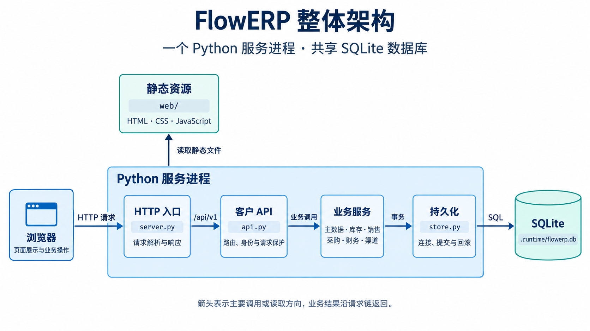

# FlowERP 架构与数据设计

[返回 README](../README.md#项目架构)

本文供修改业务服务或数据模型时查阅。首次运行请从 README 的快速开始进入。

## 整体架构

下图表示客户请求的主要调用方向。框内的后端模块运行在同一个进程中，共享 `ERPStore` 和同一个 SQLite 数据库。



图中箭头表示主要调用或读取方向，业务结果沿请求链返回。图片由 ImageGen 生成；[完整生成提示词](assets/flowerp-architecture.prompt.md)随仓库保存，模块职责与实现入口见下表。

| 层次 | 实现入口 | 负责什么 |
| --- | --- | --- |
| 客户页面 | [web/index.html](../web/index.html)、[web/app.js](../web/app.js)、[web/styles.css](../web/styles.css) | 页面结构、交互、加载与错误提示；业务数据从 API 获取，浏览器中的状态只是展示缓存 |
| HTTP 服务 | [server.py](../flowerp/server.py)、[http_bind.py](../flowerp/http_bind.py) | 提供静态资源、解析请求、输出响应与日志，管理监听端口和服务启停 |
| API 入口 | [api.py](../flowerp/api.py) 的 `APIRouter` | 创建业务服务对象，分发 `/api/v1` 请求，处理身份、CSRF、限流、维护模式和错误响应 |
| 业务服务 | `flowerp/` 下按业务划分的服务模块 | 校验权限和业务状态，执行库存、单据、账务变更，记录审计 |
| 持久化 | [store.py](../flowerp/store.py)、[schema_v2.py](../flowerp/schema_v2.py)、[schema_extensions.py](../flowerp/schema_extensions.py) | 建表与增量迁移，提供连接、提交和回滚，执行数据库约束 |

这些模块通过 Python 调用协作。SQL 主要写在业务服务中，当前没有独立的 ORM 或统一仓储层。销售和采购会在自己的事务中更新库存，并复用 `accounting.py` 的估值和记账能力；库存变更并非全部经由 `InventoryService`。报表与对账模块从已有业务表读取和核对数据。

默认部署是一个服务实例访问本地 SQLite。HTTP 请求可以并发处理，数据库使用 WAL（预写日志）和写入等待超时；`RuntimeCoordinator` 通过租约限制同一业务目录的服务实例，当前没有多实例水平扩展方案。

## 业务模块

| 模块 | 主要职责与对象 | 代码入口 |
| --- | --- | --- |
| 主数据与定价 | 仓库、库位、商品、客户、供应商、联系人与地址；价目表和价格规则 | [master_data.py](../flowerp/master_data.py)、[partners.py](../flowerp/partners.py)、[pricing.py](../flowerp/pricing.py) |
| 库存 | 入库、调拨、盘点、库存余额与流水；按库位、批次管理库存，支持序列号追踪 | [inventory.py](../flowerp/inventory.py)、[serials.py](../flowerp/serials.py) |
| 销售 | 草稿、确认、信用额度检查、原子预占、部分发货、取消和退货 | [sales.py](../flowerp/sales.py) |
| 采购 | 采购单、提交审批、制单与审批分离、收货质检、部分收货和入库过账 | [purchasing.py](../flowerp/purchasing.py) |
| 财务与核算 | 应收应付、发票、收付款与核销、会计期间；先进先出（FIFO）库存成本、借贷分录与试算平衡 | [finance.py](../flowerp/finance.py)、[accounting.py](../flowerp/accounting.py) |
| 银行与业务对账 | 银行账户、对账单导入、付款匹配；核对库存、销售、财务和总账 | [cash_management.py](../flowerp/cash_management.py)、[reconciliation.py](../flowerp/reconciliation.py) |
| 渠道订单 | 店铺、外部商品映射、订单接收与审单、转销售单、异常处理、回传任务的领取和重试 | [channels.py](../flowerp/channels.py) |
| 报表与数据交换 | 经营指标、库存与账龄报表、补货建议、预警；CSV 导入先校验再提交，支持导出 | [reports.py](../flowerp/reports.py)、[alerts.py](../flowerp/alerts.py)、[import_export.py](../flowerp/import_export.py) |

跨模块能力由 [identity.py](../flowerp/identity.py)（组织、用户、角色与会话）、[audit.py](../flowerp/audit.py)（审计）、[idempotency.py](../flowerp/idempotency.py)（请求去重）、[numbering.py](../flowerp/numbering.py)（单据编号）和 [operations.py](../flowerp/operations.py)（备份、健康检查、运行租约与事件领取）提供。

渠道模块已实现平台无关的订单处理和回传任务管理。外部平台适配器需要把订单转换为模块接受的数据，再由集成程序领取回传任务并提交处理结果。店铺的 `configured` 状态仅表示所引用的凭据环境变量存在；平台名称列表和任务队列本身不表示已完成真实平台联调。`outbox_events` 用于保存待处理业务事件，当前 `serve` 入口不会自动启动外部事件消费程序。

## 数据与业务约束

默认数据库为 `.runtime/flowerp.db`。客户 API 使用 `product_master`、`customer_master`、`supplier_master`、`stock_balance`、`sales_documents`、`purchase_orders`、`invoices` 等业务表。库存余额按 **组织 × 商品 × 库位 × 批次** 保存，`stock_moves` 记录库存流水，`stock_reservations` 记录销售预占，`journal_entries` / `journal_lines` 保存会计分录。

`ERPStore.connect()` 定义一次数据库事务的提交与回滚边界；业务服务决定哪些操作放进同一事务。一个完整业务流程通常包含多次用户操作和多个事务，不能将“共享一个数据库”理解为整条流程一次提交。

| 必须保持的规则 | 当前实现方式 |
| --- | --- |
| 可用库存不能为负 | `available = on_hand - reserved`；数据库检查约束与带库存条件的更新共同保护余额 |
| 整单预占成功或失败 | `SalesService.reserve()` 在一个事务中更新余额、预占和订单明细；任一行缺货或写入失败则回滚 |
| 重复入库不能重复增加库存 | 入库事件键有唯一约束；接入幂等包装的 API 使用 `Idempotency-Key` 与请求摘要重放结果，相同键对应不同内容时拒绝 |
| 单据状态按业务顺序推进 | 服务端校验状态；可取消的销售订单释放预占，已被草稿发货单占用的预占须先解除发货占用 |
| 采购审批与制单分离 | 采购提交后由具有审批权限的其他用户审批，审批后才能走收货流程 |
| 账务与库存可追溯 | 收发货过账复用成本估值与借贷记账，关键业务变更记录审计；对账模块检查明细与汇总的一致性 |

例如，一张已确认的销售单申请预占 3 件商品，当前在手 10 件、已预占 4 件、可用 6 件：`app.js` 提交请求，`APIRouter` 识别操作者，`SalesService.reserve()` 检查状态并更新库存和预占记录。成功后余额为 **10 / 7 / 3**；若订单中另一行缺货，则整次预占失败，余额仍为 **10 / 4 / 6**。页面重新读取 API 结果，而不是自行修改库存事实。

**兼容代码边界：** [service.py](../flowerp/service.py) 的 `ERPService` 仍保留旧模型及演示、兼容调用，使用 `products`、`stock`、`sales_orders` 等旧表，并通过 `_publish_authority()` 将部分库存变更写入当前模型。它不是客户 API 的统一业务入口，也不是两套模型的完整双向同步。新增客户功能应沿 `APIRouter → 当前业务服务` 修改，并明确所用数据表，避免混用两套模型。

## 代码导航

```text
flowERP/
├── flowerp/
│   ├── __main__.py           # python -m flowerp 命令入口
│   ├── server.py / api.py    # HTTP 服务与客户 API
│   ├── sales.py 等           # 按业务划分的服务模块，见上表
│   ├── store.py              # 数据库连接、事务与兼容表
│   ├── schema_v2.py          # 客户业务模型与迁移
│   ├── schema_extensions.py  # 账务、渠道等扩展表与迁移
│   ├── config.py             # 环境配置及校验
│   └── admin.py              # 初始化、备份、诊断等管理命令
├── web/                      # 客户页面，随 Python 服务直接提供
├── tests/                    # Python 业务/API 测试与 Node 页面逻辑测试
├── eval/                     # 业务阻断检查及 JSON 报告生成
├── deploy/Dockerfile         # 容器构建入口
├── pyproject.toml            # Python 版本、包发现与命令定义
└── .runtime/                 # 本机业务数据与报告，不入库
```

看一项功能时，按 **`web/app.js` 中的请求 → `api.py` 中的路由 → 对应业务服务 → 表结构与测试** 阅读。修改页面交互从 `web/` 入手；修改状态、库存、审批或账务规则从业务服务入手，并补充正常与失败路径测试；改表结构时同时检查迁移逻辑和旧数据兼容性。
